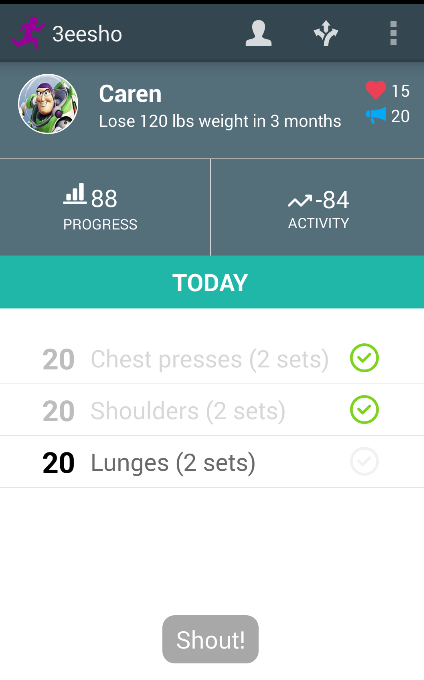
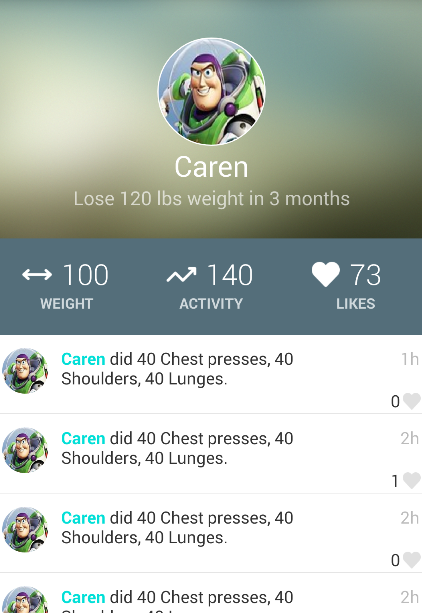
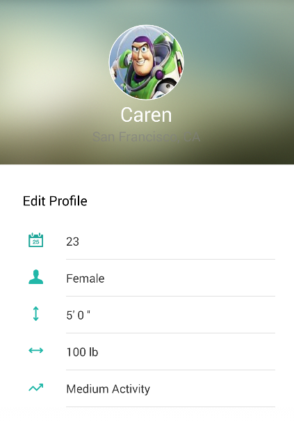
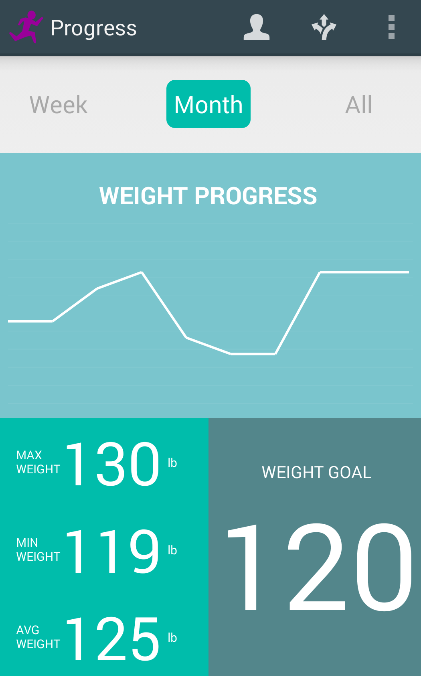
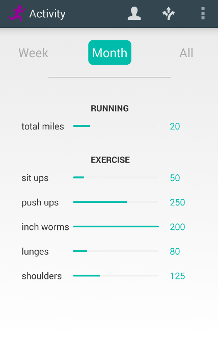

3eesho
======

An Android application that aims to help motivate users to continue healthy living by giving them personalized diet and exercise plans.

Libraries used:
Graph Library: https://github.com/Androguide/HoloGraphLibrary
Parse UI: https://github.com/ParsePlatform/ParseUI-Android
Facebook SDK: https://developers.facebook.com/docs/android/
Jodatime: http://www.joda.org/joda-time/

