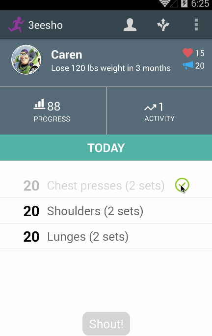

3eesho
======

An Android application that aims to help motivate users to continue healthy living by giving them personalized diet and exercise plans. The hardest part of exercising and being healthy is staying motivated, and 3eesho's app tries to overcome that problem by connecting users with a supportive community that they can lean on throughout their journey. 

Key features:
- Daily personalized diet/exercise plans 
- Progress bars/graphs showing users their activity / weight history
- Ability for users to view videos of exercises they don't know how to do
- Users can publicize their daily accomplishments and get positive feedback
- Users can see other people's daily accomplishments and give positive feedback

Libraries used:
- Graph Library: https://github.com/Androguide/HoloGraphLibrary
- Parse UI: https://github.com/ParsePlatform/ParseUI-Android
- Facebook SDK: https://developers.facebook.com/docs/android/
- Jodatime: http://www.joda.org/joda-time/

